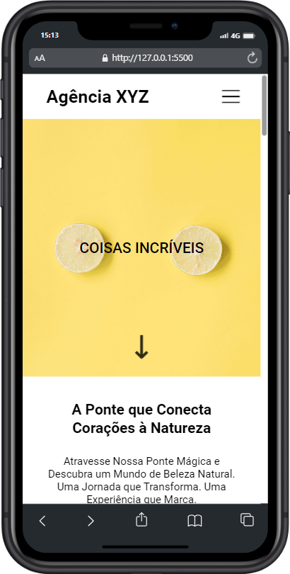

#  Agência XYZ Landing Page 💻

##  Descrição do Projeto 🌐
Este é um projeto de landing page para a Agência XYZ, resultado do meu aprendizado no curso DevQuest, onde contei com a valiosa orientação dos gêmeos. Durante essa jornada no desenvolvimento web, explorando os fundamentos do HTML5 e CSS3. 👩‍💻

## Objetivo 🎯
Desenvolver uma landing page dinâmica e responsiva para a Agência XYZ, integrando conceitos avançados de HTML, CSS, Grid, Flexbox e adicionando um menu hamburguer para uma experiência eficiente em dispositivos móveis.

## Aprendizados e Reflexões 🧠 
Este projeto não foi apenas uma linha de código, foi uma jornada de descobertas. Cada ajuste de estilo, cada alinhamento preciso, clareou não apenas a página, mas minha compreensão sobre desenvolvimento web.

## Futuras Melhorias 💻
O aprendizado nunca para, Futuras melhorias incluirão otimizações de desempenho, integração de animações e expansão das funcionalidades.

## Gratidão aos Gêmeos e ao DevQuest 🙌
Um agradecimento especial aos gêmeos por sua orientação excepcional e ao DevQuest por proporcionar uma jornada de aprendizado tão enriquecedora. Este projeto não é apenas uma página, é um capítulo significativo na minha jornada como desenvolvedor.

## Preview Gif 🎥
Dê um play e veja a mágica acontecer na landing page da Agência XYZ! Transformação rápida, com destaque para o menu hamburguer. 🌟

## Preview Desktop 🖥️ 📸
Visualize o Card Component em todo o seu desktop!

## Preview Mobile 📱 📸
Desfrute da experiência responsiva do Card Component em dispositivos móveis.

## Personalização 🎨
Sinta-se à vontade para Você modificar o projeto de landing page, adicionar mais funcionalidades ou integrá-lo a outras tecnologias.

## Tecnologias Utilizadas  💻

## Contribuição 🤝
Contribuições são bem-vindas! Sinta-se à vontade para propor melhorias, correções de bugs ou novos recursos. 🚀

### Agradeço por conferir meu projeto! Espero que este projeto de landing page tenha sido tão emocionante para você quanto foi para mim. Se tiver dúvidas ou sugestões, sinta-se à vontade para entrar em contato.

#### Divirta-se codificando! 😊 

## Contato 📲

### me segue nas redes abaixo!
 

   
  
  
  

